# Lyrics Trainer Architecture

This document describes the architecture and key flows of the Lyrics Trainer application.

## Table of Contents
- [Overall Architecture](#overall-architecture)
- [State Management](#state-management)
- [File Upload Flow](#file-upload-flow)
- [Karaoke Mode & Audio Sync](#karaoke-mode--audio-sync)
- [Theme Management](#theme-management)
- [Data Structures](#data-structures)

## Overall Architecture


## State Management

The application uses a centralized state object with localStorage persistence:


## File Upload Flow

### Plain Text and LRC File Processing


### File Source Management


## Karaoke Mode & Audio Sync


### Audio Synchronization Algorithm


## Theme Management

```mermaid
flowchart TD
    Start([App Init]) --> LoadTheme[Load theme from localStorage]

    LoadTheme --> CheckSaved{Saved<br/>Theme?}

    CheckSaved -->|'dark'| SetDark[Add dark-theme class<br/>Show ☀️ icon]
    CheckSaved -->|'light'| SetLight[Add light-theme class<br/>Show 🌙 icon]
    CheckSaved -->|null| CheckSystem{System<br/>Preference?}

    CheckSystem -->|prefers-dark| ShowSun[Show ☀️ icon]
    CheckSystem -->|prefers-light| ShowMoon[Show 🌙 icon]

    SetDark --> Ready([Theme Ready])
    SetLight --> Ready
    ShowSun --> Ready
    ShowMoon --> Ready

    Ready --> UserClick[User clicks theme toggle]

    UserClick --> CheckCurrent{Current<br/>Theme?}

    CheckCurrent -->|Dark| SwitchLight[Remove dark-theme<br/>Add light-theme<br/>Save 'light']
    CheckCurrent -->|Light| SwitchDark[Remove light-theme<br/>Add dark-theme<br/>Save 'dark']

    SwitchLight --> Ready
    SwitchDark --> Ready

    style SetDark fill:#4a9eff
    style SetLight fill:#ffa94d
    style CheckSystem fill:#51cf66
```



## Data Structures

### LyricLine Interface

```typescript
interface LyricLine {
    text: string;           // The lyric text to display
    timestamp?: number;     // Optional timestamp in milliseconds
}
```

**Usage:**
- Plain text files: Only `text` is populated
- LRC files: Both `text` and `timestamp` are populated
- Timestamps enable karaoke mode with audio synchronization

### TrainerState Interface

```typescript
interface TrainerState {
    idx: number;              // Current line index (0-based)
    delay: number;            // Auto-advance delay in milliseconds
    isKaraokeMode: boolean;   // Whether karaoke mode is active
}
```

**State Persistence:**
- Saved to localStorage on every render
- Loaded on app initialization
- Remembers position between sessions

### localStorage Schema


## Key Components

### DOM Elements (`els` object)

All interactive elements are cached in the `els` object:
- **Display**: `box`, `counter`
- **Controls**: `prev`, `next`, `playPause`, `seek`
- **Settings**: `delayRange`, `delayLabel`, `themeToggle`
- **File handling**: `uploadBtn`, `fileInput`, `resetBtn`
- **Audio**: `audioPlayer`, `uploadAudioBtn`, `audioInput`
- **State**: `loading`, `error`, `content`

### Event Flow


## Progressive Web App (PWA)


## Module Organization

```
src/script.ts
├── Interfaces & Types
│   ├── LyricLine
│   └── TrainerState
│
├── State Management
│   ├── loadState()
│   └── saveState()
│
├── Parsers
│   ├── parseLRC()
│   └── parsePlainText()
│
├── File Handling
│   ├── loadDefaultLyrics()
│   ├── processLyricsFile()
│   ├── handleFileUpload()
│   └── resetToDefaultLyrics()
│
├── Theme Management
│   ├── loadTheme()
│   └── toggleTheme()
│
├── Audio
│   ├── handleAudioUpload()
│   └── syncLyricsWithAudio()
│
├── Core Functions
│   ├── render()
│   ├── advance()
│   ├── startTimer()
│   ├── stopTimer()
│   └── toggleTimer()
│
├── Touch Gestures
│   ├── handleTouchStart()
│   ├── handleTouchEnd()
│   └── handleSwipe()
│
└── Initialization
    ├── init()
    └── setupUI()
```

## Future Enhancements

See [suggested_improvements.md](suggested_improvements.md) for planned features including:
- Multiple song playlist management
- Lyrics search and filtering
- Advanced animation effects
- Export/import configurations
- Analytics and progress tracking
